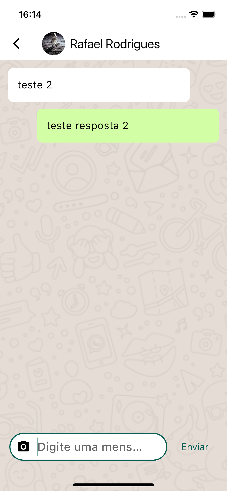

# App "Clone Whatsapp"

## Descrição

Um aplicativo desenvolvido durante o curso de Desenvolvimento Flutter Mobile, com o objetivo de entender e aplicar conceitos fundamentais na criação de um aplicativo similar ao Whatsapp. O projeto utiliza Firebase para gerenciamento de cadastro, autenticação de usuários, banco de dados em tempo real e armazenamento de imagens, proporcionando uma experiência prática e completa de desenvolvimento mobile.

## Curso

**Desenvolvimento Android e IOS com Flutter - Crie 15 Apps**

[Link para o curso na Udemy](https://www.udemy.com/course/desenvolvimento-android-e-ios-com-flutter/?couponCode=MCLARENT71824)

## Status do Projeto

- **Concluído:** 12/10/2021
- **Atualizado:** 30/07/2024

## Tecnologias Utilizadas


## Funcionalidades

- Cadastro de usuários
- Autenticação de usuários
- Gerenciamento de contatos
- Mensagens em tempo real
- Banco de dados em tempo real

## Instalação

Siga os passos abaixo para rodar o projeto localmente:

1. Clone o repositório:
    ```sh
    git clone https://github.com/rafaelleonan/app-flutter-clone-whatsapp.git
    ```
2. Navegue até o diretório do projeto:
    ```sh
    cd app-flutter-clone-whatsapp
    ```
3. Instale as dependências:
    ```sh
    flutter pub get
    ```
4. Configure o Firebase para o seu projeto:
    - Siga as instruções no [Firebase Console](https://console.firebase.google.com/)
    - Adicione os arquivos de configuração `google-services.json` (Android) e `GoogleService-Info.plist` (iOS)

5. Execute o aplicativo:
    ```sh
    flutter run
    ```

## Telas
<p>
  
  
  
  
  
  
  
  
  
  
</p>

## Video Demonstração
[Assista o vídeo 1](https://ucb62501f40aaac7a5f57ccf4112.dl.dropboxusercontent.com/cd/0/inline/CXwg1F1u77K16CT7toh2TCprVeCZf4yPUpRQ8Lc9dBAeHSjdiHFnG3Msjf6eTBbGjI4Bq9NEpEK8u3oI63G52veKu5z9tU7Y6OfKgZVYcVN1y1ETDuxZ4CjvZZsljq0jtX87n5y5cUvXFoNk5C7i_2mf/file#) <br/>
[Assista o vídeo 2](https://uc5d5462df62b1edd7b725e8f5bc.dl.dropboxusercontent.com/cd/0/inline/CXwlnHcQbGoYGaBVsaIDaYQOK4wNKgLNNoNfLTvUoCHlhd1GQuW134enlZHwvh_d8IpTzy4k6I5tC_a5AxLokqXztq644lTQLDhJ3NHwwoeEOQHZBXGGhP3E4Gaq94W02KQ_aksdUp8u1fEyaaeN7R41/file#)

